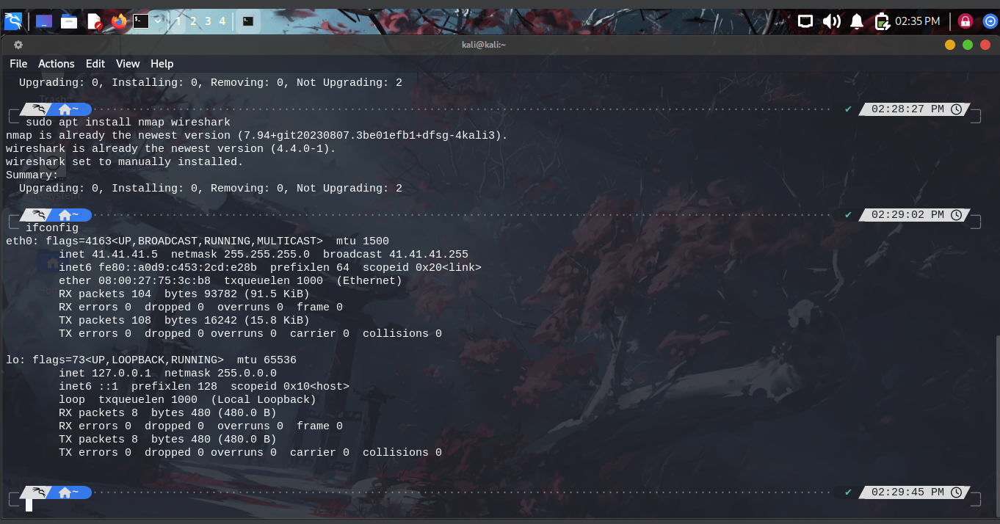
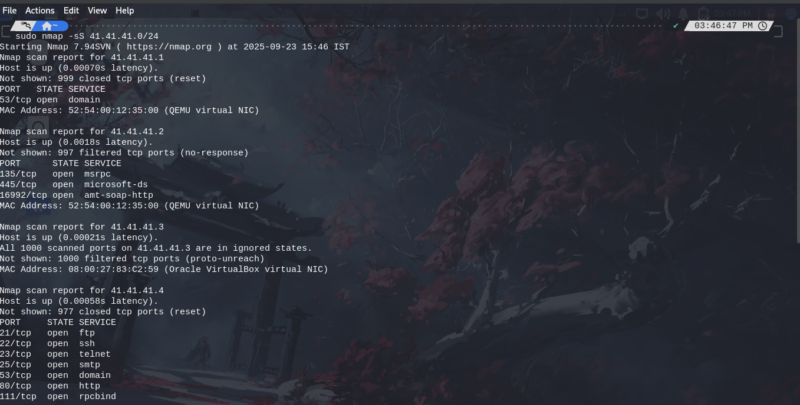
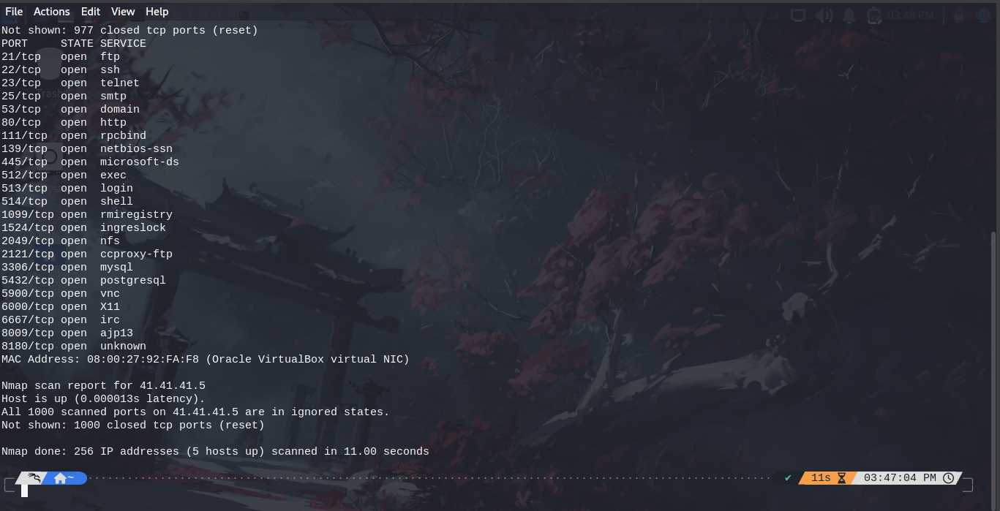
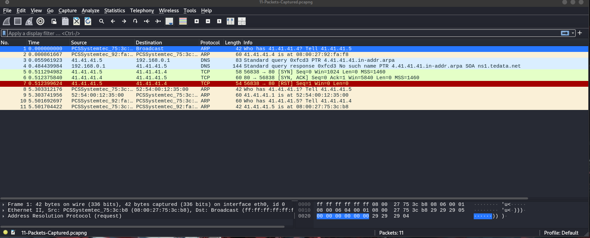

# Elevate-Labs — Task 1: Network Port Scanning & Packet Capture

## Objective
Perform controlled reconnaissance on the local subnet `41.41.41.0/24` to discover live hosts and open ports, focus on **MS-2 (41.41.41.4)**, capture traffic with Wireshark, and document findings and remediation.

---

## About
This repository contains Task-1 work for Elevate-Labs: Nmap scans, Wireshark capture(s), screenshots, and a findings summary. All actions were performed only on authorized systems.

---

## Tools Used
- **Nmap** — host discovery & port/service scanning  
- **Wireshark** — GUI packet capture & analysis  
- **Git** — version control

---

## Network Setup
- **Kali (scanner)**: `41.41.41.5`  
- **Target (MS-2)**: `41.41.41.4`  
- **Subnet scanned**: `41.41.41.0/24`

---

## Process / Steps

### 1. Setup & Install
```bash
cd ~
sudo apt update
sudo apt install -y nmap wireshark
```

### 2. Identifying Network Range

The ifconfig command was used to identify the local IP address and determine the network range to be scanned.


*Figure: `install-ifconfig.png` — Output used to confirm Kali IP `41.41.41.5` and subnet.*

IP Address: `41.41.41.5`

Network Range: `41.41.41.0/24`

### 3. Executing the Nmap Scan

An Nmap TCP SYN scan `(-sS)` was performed on the entire `/24` network range to efficiently find open ports on all potential hosts. The results were saved to a text file.

Command:

```bash
sudo nmap -sS -oN nmap_results.txt 41.41.41.0/24
```


*Figure: `nmap-scan-1.png` — Nmap output showing discovered hosts and some open ports.*


*Figure: `nmap-scan-2.png` — Continued Nmap output / detailed host results.*

### 4. Packet Analysis with Wireshark

Simultaneously with the Nmap scan, Wireshark was used to capture the network traffic. This provided a clear analysis of how the TCP SYN scan works by observing the exchange of **SYN** and **SYN/ACK** packets between the scanner and the target host.


*Figure: `wireshark-capture.png` — Wireshark capturing traffic to/from `41.41.41.4` during the scan.*

## Scan Results

The Nmap scan identified 5 active hosts within the 41.41.41.0/24 network range. The most notable findings were from host 41.41.41.4, which had a wide variety of open ports.

### Summary of Open Ports on 41.41.41.4:

| Port | State | Service       | Potential Risk |
|------|-------|---------------|----------------|
| 21   | open  | ftp           | Unencrypted data transfer, including credentials |
| 22   | open  | ssh           | Secure if configured correctly, but a target for brute force |
| 23   | open  | telnet        | Unencrypted communication, highly insecure |
| 80   | open  | http          | Potential for web-based vulnerabilities |
| 139  | open  | netbios-ssn   | Legacy service, can be vulnerable (e.g., WannaCry) |
| 445  | open  | microsoft-ds  | File sharing, common vector for malware (e.g., SMB exploits) |
| 3306 | open  | mysql         | Database access, could be vulnerable to SQL injection |
| 5900 | open  | vnc           | Remote desktop, potential for unauthorized access |


For a complete list of all hosts and open ports, see the `nmap_results.txt` file.

## Interview Questions & Answers

Refer `Interview-Questions.md` file

## Supporting Files In This Repository

`nmap_results.txt` - The full text output from the Nmap scan.

`wireshark_capture.pcap` - The packet capture file from Wireshark.

`screenshots/` - Directory containing all screenshots taken during the process
